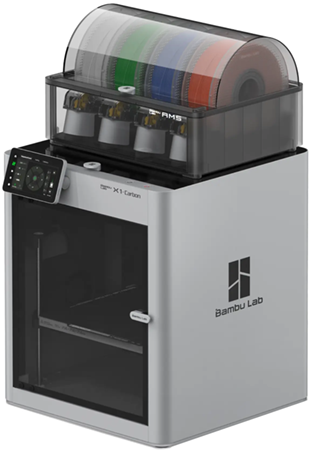
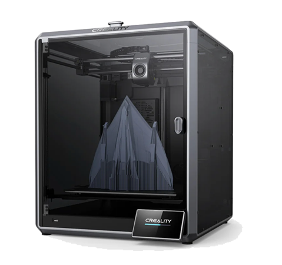

# Available machines

## Bambu Lab X1c

The Bambu Lab X1c has a build volume of 256 x 256 x 265 mm and usually uses a 0.4mm nozzle.

Link to [official Wiki](https://wiki.bambulab.com/en/home)

To make use of all features use [Bambu Studio](https://bambulab.com/en/download/studio) or our recommended solution [Orca Slicer](https://github.com/SoftFever/OrcaSlicer)
You can also use any other 3rd party slicer like [Cura](https://ultimaker.com/software/ultimaker-cura/) but Lidar & multi material printing won't work with these.

## Creality K1 max

We have 2 Creality K1 max Printers with a build volume of 300 x 300 x 300 mm usually one of them is equipped with a 0.4mm nozzle and the other one with a 0.8mm nozzle.

For slicing we recommend [Orca Slicer](https://github.com/SoftFever/OrcaSlicer) another option is [Creality Print](https://www.crealitycloud.com/software-firmware/software/creality-print) its profile is a bit better tuned for speedy printing. 

The Creality printers use Klipper firmware [Official Documentation] (https://www.klipper3d.org/Overview.html)
You can access the printers via webinterface.
IP left printer (0.8 nozzle): https://172.22.0.254:4408 
IP right printer (0.4 nozzle) https://172.22.3.249:4408
