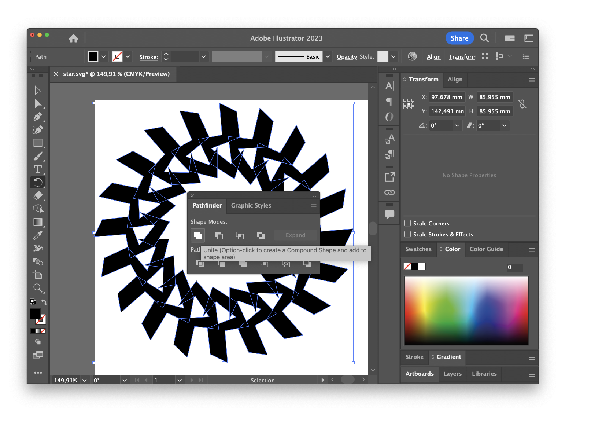
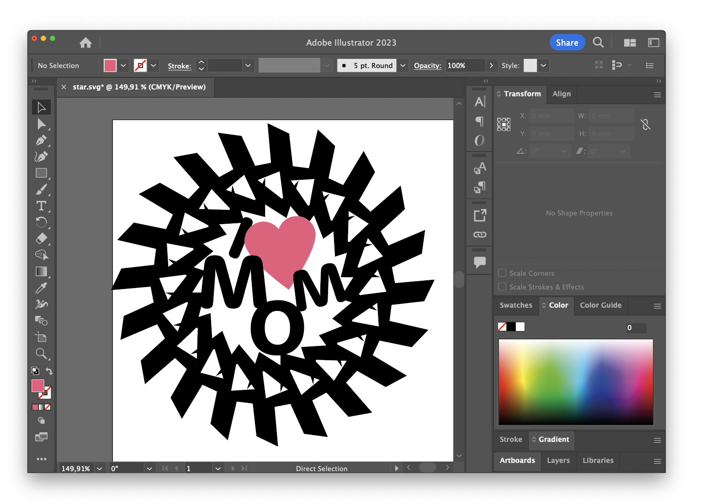
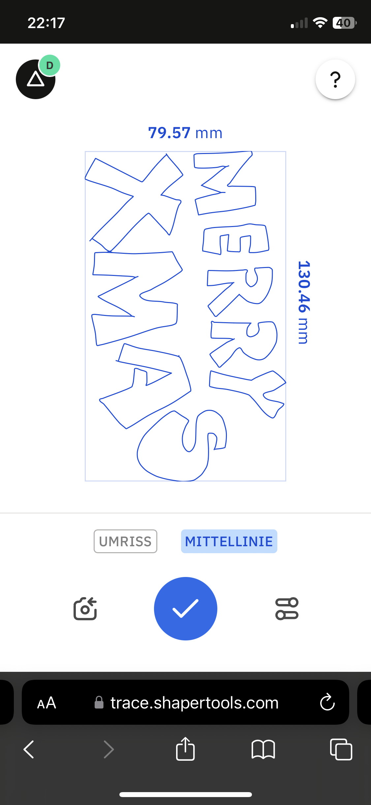

# Tutorials

## 3d printing with Vector Files
It's possible to import SVG files into the slicing software, give them a thickness (extrude) and 3d print them.
This works in Pruse SLicer, Orca Slicer & Bambu Studio.

Import your SVG file, the printer will directly show an extruded version with a height of 10mm.
For creating small signs set Z-height to 2mm (uncheck uniform scale) and adjust XY scale as needed.

sliced SVG:

### Creating a Christmas Ornament with Adobe Illustrator

- Draw a vector shape
- select rotate tool, click on intended rotation center while holding 'alt key'
- chose an angle that is a divider of 360°
- hit copy

- press 'cmd/crtl + D' to repeat previous operation
- repeat to fill the circle

- select all shapes
- open pathfinder window and select the unite icon to create one vector shape
  

- to add type use the text tool
- go to 'type' tab and select create outlines

- arrange type so the letters become connected.
- use pathfinder - unite operation

- import in slicer and print

### Creating Signs with Bambu Lab "MakeMySign" app

- head over to makerworld and log in with the maker universe credentials (look them up on the bambulab printer)

https://makerworld.com/en/makerlab/makeMySign

### Trace with "shaper trace frame"

- locate trace frame

- open website from mobile: https://trace.shapertools.com/
- login using the makeruniverse account (find credentials on back of the frame)

- once the frame is registered take your image

- edit if needed

- download and send it by mail or use airdrop

