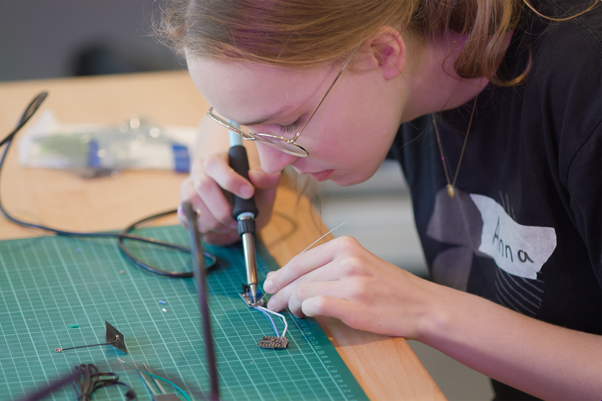

A Hardware Studio to shape physical objects

## Access Control - Fabman

Access to some of our machines / tools in the Hardware Studio is managed over [Fabman](https://fabman.io) (e.g. the laser cutter and soldering stations). Upon completion of a training (clicking on the button below the videos), we will automatically create your Fabman account in our Maker Universe. You will receive an email with a link to set your password and log in to Fabman. After that, you are ready to go and use our machines. To turn on the machines, you will need to use your smartphone and scan the QR code on the Fabman bridge (a little black box next to each machine). Alternatively you can now use your HPI key to sign into the bridge! Use the button below to create an account without completing a training yet or pair your key. If you have further questions feel free to contact us!

    <a class="button" href="https://access.maker.hpi.de/" target="_blank">Create a Fabman Account</a>
    <a class="button" href="https://access.maker.hpi.de/keyAssignment" target="_blank">Assign your HPI key to your Fabman Account</a>

The following machines / tools require authentication over Fabman:

| Machine / Tool | Mandatory Training |
|-|-|
| Laser Cutter | [How to Use the Laser Cutter](#how-to-use-the-laser-cutter) |
| Soldering Stations | [How to use the Soldering Station](#how-to-use-the-soldering-station) |

## Poster Prints

<iframe width="560" height="315" src="https://www.youtube.com/embed/OtVmBPOy3QA?si=bvUwEyUOJchU_tIv" title="YouTube video player" frameborder="0" allow="accelerometer; autoplay; clipboard-write; encrypted-media; gyroscope; picture-in-picture; web-share" referrerpolicy="strict-origin-when-cross-origin" allowfullscreen></iframe>

The Plotter requires you to have a Fabman account in order to use it. Please make sure to create one using the button below.
Using your smartphone, or by assigning you HPI key to your Fabman account, you will be able to power on the plotter.

<a class="button" href="https://access.maker.hpi.de/" target="_blank">Create a Fabman Account</a>

## Label Printer: QL-820NWBc

This QL-820NWBc can print up to 62mm in width. If wider: You might change the orientation of the label in the software to fit the label on the printer.

You can use the printer via Wi-Fi (hpi-studios) and via USB. You can find the software on our Modeler Workstation.

Download:

- [MacOS](https://apps.apple.com/de/app/brother-p-touch-editor/id1453365242?mt=12)
- [Windows](https://support.brother.com/g/s/es/inst/de/index.htm?c=de&lang=de&navi=off&comple=on&redirect=on)

## 3D Printers
### Bambu A1 Mini
Use Bambu a1 Mini when you print small objects with a single filament.

### Bambu X1
Use Bambu X1x when you print large objects of up to 256 x 256 x 265 mm, or objects with up to four different types or filaments.

**Warning**
The Bambu has a Snakehouse Fan Duct, which is a bit too close to the bed, on the left of the enclosure. If thin/fragile parts are located on the left side of the bed, near to the edge, they might warp due to the fan blowing on it. If that happens disable the AUX Fan and print with open enclosure: [OrcaSlicer AUX Fan Settings](../3D_Printing/img/auxfan-orca.png)

### Prusa XL
Use Prusa XL when you print large objects and / or objects with multiple filament types.

To use all features of the Prusa XL we recommend to use [Download: Prusa Slicer](https://www.prusa3d.com/en/page/prusaslicer_424/)
You can send jobs remotely with [prusa connect](https://connect.prusa3d.com/)

If you want to use various nozzle widths in one print, you need to use simplify 3d for slicing.
we have a profile for Prusa XL here:

??? "Printing with Vector Files"

    It's possible to import SVG files into the slicing software, give them a thickness (extrude) and 3d print them.
    This works in Pruse SLicer, Orca Slicer & Bambu Studio.

    Import your SVG file, the printer will directly show an extruded version with a height of 10mm.
    For creating small signs set Z-height to 2mm (uncheck uniform scale) and adjust XY scale as needed.

- [ ] import model in OrcaSlicer
- [ ] use "auto orient" to position model
- [ ] select textured PEI plate for PLA
- [ ] check if model needs support structure
- [ ] assign filament
- [ ] print on one of our printers
- [ ] tag printer with your name

??? "Alternative: Use Orca Slicer on your Laptop"
    https://github.com/SoftFever/OrcaSlicer

    Install with brew: `brew install orcaslicer`
    AUR: `orca-slicer`
The easiest way to use the printers is sending files remotely. Upon installation you will be asked if you want to install the network plugin. We recommend to do this. The login credentials are:

User: makeruniverse@hpi.de
PW: Freezable-Scoured3-pigment

??? "3D Print Online Ressources"

    https://www.printables.com/  
    https://www.thingiverse.com/  
    https://thangs.com/  
    https://makerworld.com/

## 3D Modelling

### Blender

Blender is an open-source 3D modeling, animation, and rendering software. 

You can get access to Blender through our workstations in the Media Studio  
[Free Download](https://www.blender.org/download) 

### Autodesk Fusion

Parametric CAD software with a powerful CAM module.

Full version free to use with educational autodesk account.

## 3D Printing Software: Orca Slicer
The workstations in our Media Studio and our Hardware Studio offer access to Orca Slicer. Orca Slicer is your best option to prepare 3D prints.

## Electronic Workstation

### How to use the Soldering Station

<iframe width="560" height="315" src="https://www.youtube.com/embed/mrcoVMDm8TQ?si=wCLOkC2F15g1un5-" title="YouTube video player" frameborder="0" allow="accelerometer; autoplay; clipboard-write; encrypted-media; gyroscope; picture-in-picture; web-share" referrerpolicy="strict-origin-when-cross-origin" allowfullscreen></iframe>

After you have watched the video, you can click the button below to finish the training and gain access to the soldering stations.

<a class="button training-btn" href="https://access.maker.hpi.de?training=2875">Finish Training</a>

### Soldering Basics

<iframe width="560" height="315" src="https://www.youtube.com/embed/IPNhoHG1Vk8?si=MaF7oI4FSIweDpfJ" title="YouTube video player" frameborder="0" allow="accelerometer; autoplay; clipboard-write; encrypted-media; gyroscope; picture-in-picture; web-share" referrerpolicy="strict-origin-when-cross-origin" allowfullscreen></iframe>

### Multimeter

### Microscope

### Materials

## Textile Workstation

### Sewing Station Part 1 / Fabric Basics & Preparation

<iframe width="560" height="315" src="https://www.youtube.com/embed/IbTu8bqhhN4?si=fCGSHkbb6hh5jlVY" title="YouTube video player" frameborder="0" allow="accelerometer; autoplay; clipboard-write; encrypted-media; gyroscope; picture-in-picture; web-share" referrerpolicy="strict-origin-when-cross-origin" allowfullscreen></iframe>

### Sewing Station Part 2 / Threading the machine

<iframe width="560" height="315" src="https://www.youtube.com/embed/TaYJzNtdgf4?si=7uJzizazBxWlBbmZ" title="YouTube video player" frameborder="0" allow="accelerometer; autoplay; clipboard-write; encrypted-media; gyroscope; picture-in-picture; web-share" referrerpolicy="strict-origin-when-cross-origin" allowfullscreen></iframe>

### Sewing Station Part 3 // Introduction to Sewing

<iframe width="560" height="315" src="https://www.youtube.com/embed/lHvPy24lTf4?si=4-6iz1xlMLvrCKwu" title="YouTube video player" frameborder="0" allow="accelerometer; autoplay; clipboard-write; encrypted-media; gyroscope; picture-in-picture; web-share" referrerpolicy="strict-origin-when-cross-origin" allowfullscreen></iframe>

## Vinyl Plotter

<iframe width="560" height="315" src="https://www.youtube.com/embed/qeMTyhBgIHw?si=sFd4AOqkz664uamn" title="YouTube video player" frameborder="0" allow="accelerometer; autoplay; clipboard-write; encrypted-media; gyroscope; picture-in-picture; web-share" referrerpolicy="strict-origin-when-cross-origin" allowfullscreen></iframe>

## Laser Cutter

### How to Use the Laser Cutter

In this video David will show you how to use our laser cutter. He will explain the basics of the machine, safety precautions, and how to use the software by cutting a simple design.

<iframe width="560" height="315" src="https://www.youtube.com/embed/Jb2Sp960G6Y?si=Wp_ZsHUosVJCcuUp" title="YouTube video player" frameborder="0" allow="accelerometer; autoplay; clipboard-write; encrypted-media; gyroscope; picture-in-picture; web-share" referrerpolicy="strict-origin-when-cross-origin" allowfullscreen></iframe>

The Laser Cutter Workstation is located in the small Hardware Studio next to the Trotec Laser Cutter.

[Laser Cutting Intro Slides](/docs/mediaassets/templates/laser-cutting-intro.pdf)

After you have watched the video, you can click the button below to finish the training and gain access to the laser cutter.

<a class="button training-btn" href="https://access.maker.hpi.de?training=2740">Finish Training</a>

<!-- Style and Script tags for the button to be disabled until user clicks on the video. -->

