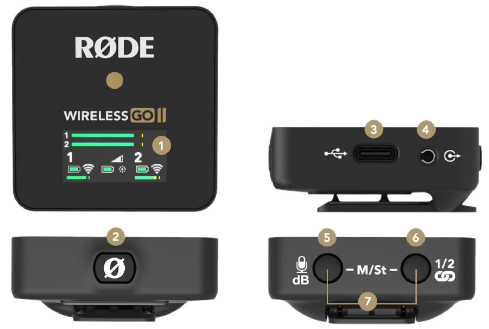
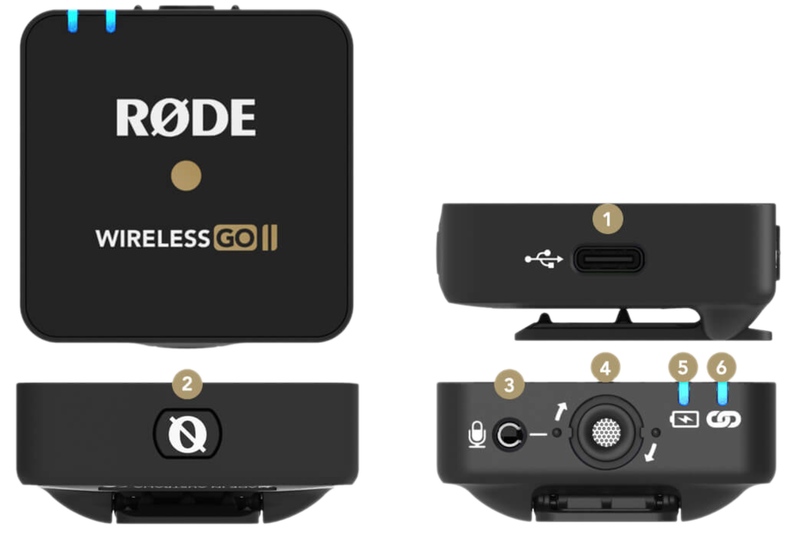
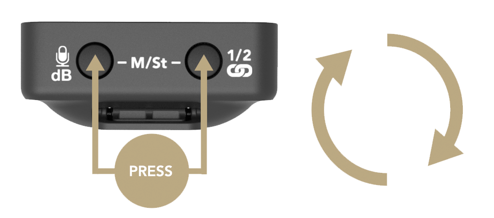

Our Media Studio offers services and tools to create **visual and audio experiences**. All tools are accessible through workstations.

## "Mac Studio"

        Apple M2 Ultra 24-Core CPU, 60-Core GPU 
        192GB RAM 
        1 TB SSD 

## "Alienware"

        AMD Ryzen 9 7950X 16 Cores Processor, up to 5,70 GHz  
        32 GB RAM DDR5, 4800 MHz 
        1 TB SSD NVMe-M.2-PCIe-SSD  
        1 TB 7.200 1/min SATA 6 Gbit/s  
        NVIDIA GeForce RTX 4090 Grafik (24 GB)  

## "Captiva"

        AMD Ryzen 7 7700X 8-Core Processor, up to 5,40 GHz  
        32 GB RAM  
        1 TB SSD  
        NVIDIA GeForce RTX 4090 Grafik (24 GB)  
        Windows 11 Home 64 Bit

### Retouching in Photoshop with Ai

 <iframe width="560" height="315" src="https://www.youtube.com/embed/oi4oepQPvww?si=Gc6W-1VZO87nlMul" title="YouTube video player" frameborder="0" allow="accelerometer; autoplay; clipboard-write; encrypted-media; gyroscope; picture-in-picture; web-share" referrerpolicy="strict-origin-when-cross-origin" allowfullscreen></iframe>

### Video Editing in Premiere Pro

  <iframe width="560" height="315" src="https://www.youtube.com/embed/n2Nnjkm0f-0?si=fkPrQvYjjbwMUZCC" title="YouTube video player" frameborder="0" allow="accelerometer; autoplay; clipboard-write; encrypted-media; gyroscope; picture-in-picture; web-share" referrerpolicy="strict-origin-when-cross-origin" allowfullscreen></iframe>

## Photo & Video Studio

The Photo & Video Studio is a setup for video recordings and photo shoots in our Media Studio.

### Portrait Photography

  <iframe width="560" height="315" src="https://www.youtube.com/embed/bKpvOl86I3Q?si=BZxxn2kExg1mdD4H" title="YouTube video player" frameborder="0" allow="accelerometer; autoplay; clipboard-write; encrypted-media; gyroscope; picture-in-picture; web-share" referrerpolicy="strict-origin-when-cross-origin" allowfullscreen></iframe>

To retouch in Adobe Photoshop, see this [Tutorial](http://makeruniverse.github.io/docs/studios/media-studio.html#retouching-in-photoshop-with-ai)

### Video with Teleprompter

 <iframe width="560" height="315" src="https://www.youtube.com/embed/SUCGFXvN598?si=tZVTTIQJQutmqaBT" title="YouTube video player" frameborder="0" allow="accelerometer; autoplay; clipboard-write; encrypted-media; gyroscope; picture-in-picture; web-share" referrerpolicy="strict-origin-when-cross-origin" allowfullscreen></iframe>

### Equipment

#### RØDE Wireless Microphone System

The Wireless GO II [(Link to product page)](https://rode.com/en/user-guides/wireless-go-ii){target="_blank"} is a dual channel wireless microphone system with an transmission range of 200 metres (line of sight).

??? "RØDE Wireless GO II - How to and manual"

    To switch on, press and hold the power button of the receiver and the required transmitter (one or both) for three seconds. Tthe transmitters will pair automatically with the receiver. If the transmitters cannot establish a connection to the receiver, the blue "∞" button on the transmitters lights up. To pair the transmitter with the receiver again,press the '∞' button on the receiver for three seconds. After this, switch the transmitter on again using the power button. 
    To disconnect a transmitter from the receiver, select the transmitter to be disconnected using the pairing or channel button and hold this button for three seconds.

    {: style="width:75%;"}  

    <b>Receiver:</b>

    <b>1</b> LED Screen  
    <b>2</b> Power Button  
    <b>3</b> USB-C Connector  
    <b>4</b> 3.5mm TRS Output  
    <b>5</b> Gain Control (only affects the 3.5mm output, not USB-C) / Mute Button  
    <b>6</b> Pair Button / Channel Selection  
    <b>7</b> Merged / Split Mode Selector   

    {: style="width:75%;"}  

    <b>Transmitter:</b>

    <b>1</b> USB-C Connector  
    <b>2</b> Power Button  
    <b>3</b> 3.5mm TRS Input  
    <b>4</b> In-built Mic  
    <b>5</b> Battery Indicator LED  
    <b>6</b> Connectivity Indicator LED  

    You can decide whether you want to record in "Merged" or "Split" mode. In "Split" mode, both channels are recorded as separate audio tracks. You can tell that "Split" mode is switched on by the presence of two output levels. The individual audio tracks can be edited in post-production. 
    Split mode is particularly suitable for interviews with two people, as each audio track is recorded separately and can be edited. In "Merged" mode, the receiver combines the recordings into one audio track. To use the different modes, press the two buttons on the receiver simultaneously.

    {: style="width:75%;"}   

    <iframe width="560" height="315" src="https://www.youtube.com/embed/F-Iny4IdEeI?si=RQ9tP3fXkRnIlnK_" title="YouTube video player" frameborder="0" allow="accelerometer; autoplay; clipboard-write; encrypted-media; gyroscope; picture-in-picture; web-share" referrerpolicy="strict-origin-when-cross-origin" allowfullscreen></iframe>
