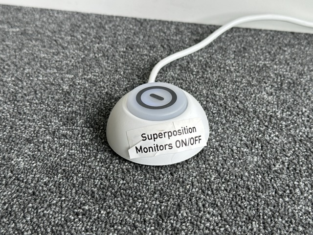

The researcher studio allows students and researchers to setup and to test new **user experiences**. 

Get in contact with our Researcher Studios team for help. 

Here is a list of **tools and services** that are available:

## UX Workstation

Our UX Workstation allows for professional video recordings for various kinds of user studies.

The **setup** comprises 4 PTZ cameras, a Shure audio panel, a recording workstation, and a coffee table with two chairs.

??? "UX Case Study Examples"
    - User Interviews
    - UX / Usabiltiy Tests
    - Standardized Questionnaires
    - Field Observations
    - Prototype User Tests

??? "How to get Access"

    Get in contact with our colleague [Jan](../team/team.md) to plan your UX-project or leave a message in our Slack Channel #contact-our-team.

## Superposition Workstation

Project teams of up to four people can book our Super Position setup to work in parallel by sharing their screens with each other.

The four screens are connected to the [KVM Matrix-Switcher](https://kvm-switch.de/de/4-x-4-hdmi-2-0-multiview-seamless-matrix-switch-mit-video-wall-funktion-uniclass-rh-244.html){target="_blank"}. An [AirServer](https://www.airserver.com/connect-3){target="_blank"} (screens 1, 2 and 3) and an HDMI cable (screen 4) act as feeders. A connection via AirPlay 2, Google Cast and Miracast is possible via the AirServer.

??? "How does the connection and the display work?"

    First, the entire setup must be switched on using the foot switch (lights up blue).

    {: style="width:25%;"}  

    As soon as the first device connects to the AirServer, it is routed to the first screen. If a second device follows via a wireless connection, it is played on the second screen and so on.

    {: style="width:25%;"}  

    This is the default setup after switching on and can be reset at any time by first pressing the RECALL button and then the A button.

    

    If a single screen is to be displayed on all four screens, RECALL must be pressed first and then the button for the corresponding input (1-4).

    {: style="width:25%;"}  

    

 
